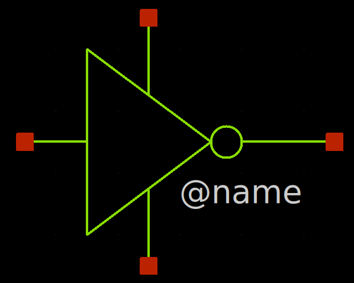
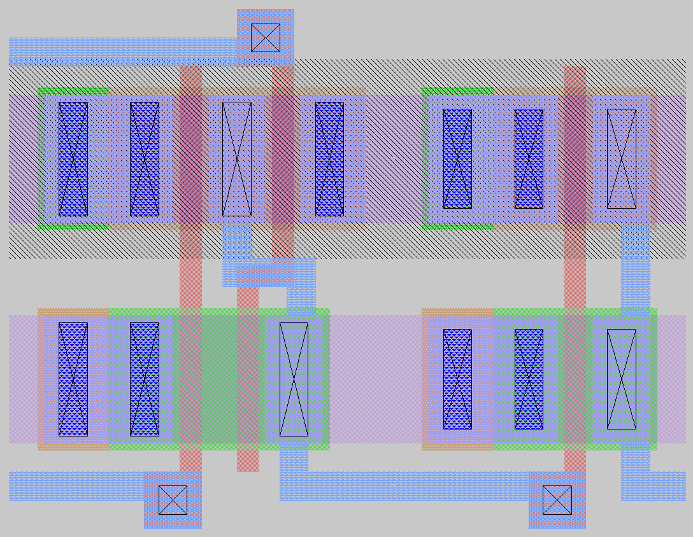

## Mini Project 1 - AND Gate

All the files created for this project can be found in the `mini_proj_1` folder in the following github reposistory: https://github.com/wFairmanOlin/MADVLSI/. This report was autogenerated from the project's [README](https://github.com/wFairmanOlin/MADVLSI/blob/master/mini_proj_1/README.md). If anything seems fishy, please go there.

### Schematic Capture and Simulation
The final and gate was created from the following sub-circuits

#### Inverter
The inverter consisted of a single pmos pull-up transistor and nmos pull-down transistor.


The symbol for the inverter is shown below:



#### Nand Gate
The nand gate consisted of two pull-up pmos transistors in parallel and two pull-down nmos transistors in series.


The symbol for the nand gate is shown below:


#### And Gate
The final schematic for the and gate consists of a nand gate with the output feed through an inverter.


The symbol for the inverter is shown below:


#### Xschem Simulation
The following image depicts the testbench setup to simulate the and gate and all possible combination of inputs.


For the simulation I chose the typical model of mosfets (TT_Models). To test all potential input combinations, I fed a square wave into inputs A and B with the A input have a period that is twice as long as the B input. 

#### Simulation Results
As expected the and gate output pin was set to 1.8V when both input gates were set to 1.8V and set to 0V in all other combinations of A and B. 


### Layout Design
Just like the schematic, I followed a hierarchical design for the physical layout of the gate by building two independent sub-circuits. In order to combine multiple sub-circuits with ease, both the nand and inverter sub-circuits have power rails and logic pins located in the same physical position. 

#### Inverter Layout
The inverter layout consisted of a single nmos and pmos transistor with each of the gates connected to the input pin.


#### Nand Layout
As mentioned previously, the nand gate consisted of two pmos transistors connected in parallel with the output fed into two nmos transistors in series. Both transistors in the pmos and nmos networks share the same bulk contacts.


#### And Layout
By simply combining the nand and inverter layouts I was able to create the following layout.



### Layout Vs Schematic
To compare the netlists from the layout and schematic files I used netgen with the `lvs.py` wrapper. The results can be found in the `comp.out`. The following section a print out from the `comp.out` file:

```
Subcircuit summary:
Circuit 1: nand                            |Circuit 2: nand                            
-------------------------------------------|-------------------------------------------
sky130_fd_pr__pfet_01v8 (2)                |sky130_fd_pr__pfet_01v8 (2)                
sky130_fd_pr__nfet_01v8 (2)                |sky130_fd_pr__nfet_01v8 (2)                
Number of devices: 4                       |Number of devices: 4                       
Number of nets: 6                          |Number of nets: 6                          
---------------------------------------------------------------------------------------
Circuits match uniquely.
Netlists match uniquely.

Subcircuit pins:
Circuit 1: nand                            |Circuit 2: nand                            
-------------------------------------------|-------------------------------------------
Y                                          |Y                                          
VN                                         |VN                                         
A                                          |A                                          
B                                          |B                                          
VP                                         |VP                                         
---------------------------------------------------------------------------------------
Cell pin lists are equivalent.
Device classes nand and nand are equivalent.

Subcircuit summary:
Circuit 1: inverter                        |Circuit 2: inverter                        
-------------------------------------------|-------------------------------------------
sky130_fd_pr__nfet_01v8 (1)                |sky130_fd_pr__nfet_01v8 (1)                
sky130_fd_pr__pfet_01v8 (1)                |sky130_fd_pr__pfet_01v8 (1)                
Number of devices: 2                       |Number of devices: 2                       
Number of nets: 4                          |Number of nets: 4                          
---------------------------------------------------------------------------------------
Circuits match uniquely.
Netlists match uniquely.

Subcircuit pins:
Circuit 1: inverter                        |Circuit 2: inverter                        
-------------------------------------------|-------------------------------------------
Y                                          |Y                                          
A                                          |A                                          
Vp                                         |VP                                         
Vn                                         |VN                                         
---------------------------------------------------------------------------------------
Cell pin lists are equivalent.
Device classes inverter and inverter are equivalent.

Subcircuit summary:
Circuit 1: schematic/and.spice             |Circuit 2: layout/and.spice                
-------------------------------------------|-------------------------------------------
nand (1)                                   |nand (1)                                   
inverter (1)                               |inverter (1)                               
Number of devices: 2                       |Number of devices: 2                       
Number of nets: 6                          |Number of nets: 6                          
---------------------------------------------------------------------------------------
Circuits match uniquely.
Netlists match uniquely.
Cells have no pins;  pin matching not needed.
Device classes schematic/and.spice and layout/and.spice are equivalent.
Circuits match uniquely.
```


