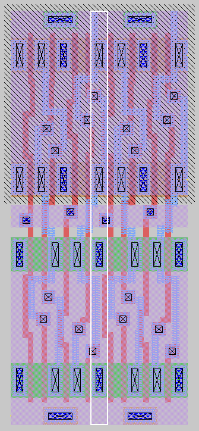

# Mini Project 2 - 4bit Shift Register

All the files created for this project can be found in the `mini_proj_2` folder in the following github reposistory: https://github.com/wFairmanOlin/MADVLSI/ .
The goal of this project was to create a positive-edge triggered shift register while optimizing the design to minimize width. 

## Schematic Capture and Simulation

The shift register consisted of 4 d-flip-flops with an inverter attached to the input of the first dff to provide \~d. My schematic for the d-flip-flop was based off of Sivilotti's 14-transistor dff. However, instead of using 7 transistors to build the two latches within the dff, I decided to use the modified version with 8 transistors per latch with a total of 16-transistors within the dff. The even number of transistors per latch allows for easier layout with a more symmetric design. Sivilotti's circuit requires the current through `Q5` to be larger than the current through `Q3` in order for the dff to operate. However, even with a width of 1 for `Q5`, the dff still performed as expected at a clock frequency of `100Mhz` with a rise time equal to `10%` of the clock period. 

Sivilotti's DFF:

Modified Phi-Latch:

### Layout Driven Schematic

In order to minimize the total width of the dff I ended up designing two different versions of the dff: one with a width of two transistors and the other with a width of 4 transistors:

Both of these designs shared the same symbol and testbench design in xschem:

### Simulation

Explained in further detail below, the 4 transistor wide dff layout ended up having the shortest overall width. To make a shift register in xschem, I attached four of these dffs in series with an inverter attached to the input of the first dff. The schematic and test bench of this design is shown below:

Even with all of the transistors sharing the same strenght ratio, the shift register worked as expected. The waveform below shows the output of each dff starting to change when `phi` is driven high with `q` and `~q` outputting the correct value half a period later when `phi` is driven low. A clock signal of `100Mhz` is very close to the highest clock signal this design can tolerate. With the clock signal raised to roughly `108Mhz` , the dffs failed to operate properly. By increasing the width of transistors `Q5` and `Q10` in the original Sivilotti diagaram, I was able to able to successfully run the shift register at a clock rate of `500Mhz`.

## Layout

### DFF Layout

To find a design that minimizes width, I decided to create two different layouts with a transistor width of 2 and 4. The following image shows the dff design with a width of only two transistors. With 8 rows of transistors, the design required several vertical interconnects. These interconnects added a significant amount of width and made the overall area of a single dff very large. Still, this dff layout had a total standalone width of only `3 microns`: including `.2 microns` of width being only nwell to mitigate drc errors. The length of this design was `17.45 microns` with the total area being `52.35 square microns`.

A 4 transistor wide layout seemed much more reasonable with only 4 rows of transistors. The standalone, four transistor wide layout is shown below. Even with the lack of vertical interconnects this design still had a width of only `3.25 microns` with `.4 microns` dedictated to mitigating nwell drc errors.The length of this design is more reasonable at `12.35 microns`. 

A major benefit of this design is that the sources and drains in the last row directly connect to the source and drains in the first row of the next dff. This allowed me to design the dff's to overlap each other as shown below. Now the first `n -1` dff's within a `n-bit` shift register will have a width of only `2.35 microns` with the `nth` dff having a width of `3.25 microns`.  With a width of `2.35 microns` and length of `12.35 microns`, the first `n-1` dffs have an area of only `29.02 microns`: beating the 2 transistor wide design in both width and total area.

### Inverter Layout

To continue the theme of minimizing overall width, I designed an inveter with minimal width. The inverter also has an additonal input for `phi`  and an additional output `d` to provide all of the necessary signals for the first dff in the shift register. The overall width of the inverter was `1.65 microns`.

### Shift Register Layout

The overall size of the shift register is `11.75 microns` wide by `12.35 microns` tall. I included two images belowing showing the overlap of the individual components as well as the final design of the shift register. Each individual dff has a secondary `q` output leading out the top of the design so that all 4 for bits of information can be accessed. 

## LVS

I performed lvs tests for the inverter, dff, and final shif register. All three passed and the resulting `   comp_.out` can be found in the `mini_proj_2` folder. 